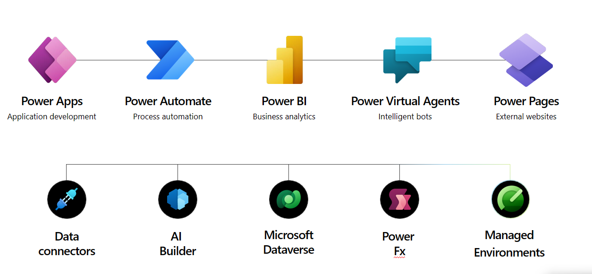
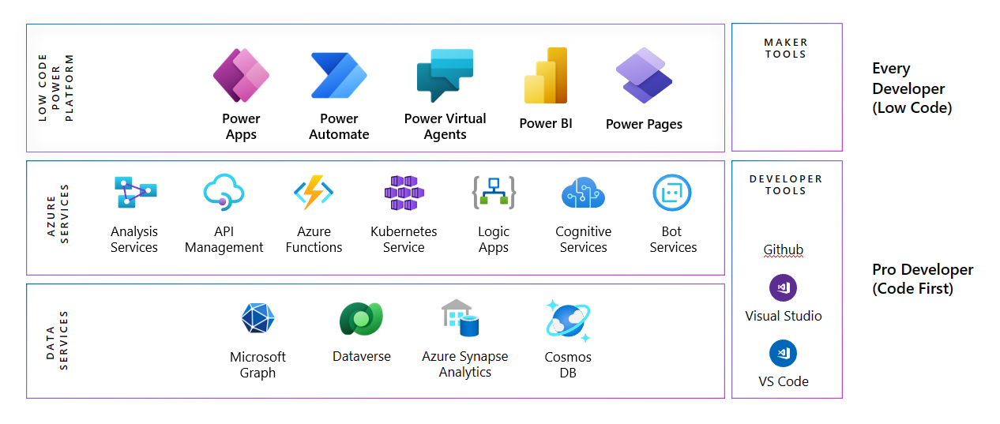

## You say Low, I say Code!

There is a low code revolution underway. We have a surging digital demand with an estimated 500 million more apps that will need to be created in the next 5 years. More and more companies are leveraging low code and no code platforms to bridge this app gap and address workflow and automation needs. In fact, Gartner estimates that 65% of application development will be low code by 2024.

With low code tools like the Power Platform making it easier for business technologists to develop solutions, you might wonder if there's any room for a code first developer in this low code revolution. Well, the answer is, absolutely there is! In fact, code first developers are a critical piece to the puzzle.

## Low Code + Full Code = No Cliffs

Using low-code tools is key to helping to resolve the existing and impending app gap challenge but that doesn't mean that low code alone can solve every business problem. Low code tools like the Power Platform's full potential is unlocked when you combine the low code capabilities with code first development.

The combination of low code + full code creates what we call a "no cliffs" experience that allows business technologists to easily build solutions with low code while professional developers can leverage full code to augment and extend the platform capabilities. The process of low code developers, IT pros and full code developers working together like this is often referred to as "fusion development".

## What is "low code"?

The term "low code" can mean different things to different people when they first hear it. What we mean when we talk about low code is that with tools like Power Apps, you only need to write a small amount of code to get results that would normally take several more lines of code in a traditional programming language.

In canvas-based Power Apps, the low code scripting language used is called [Power Fx](https://aka.ms/LearnPowerFx). This language is based on the Microsoft Excel formula language which meets many business technologists where they are by leveraging the knowledge they already have.

## What does the Power Platform Provide?

The Power Platform gives us a holistic suite of low code tools that work together to help us solve business problems. The key products and components of the Power Platform include:

* **Power Apps** for creating custom applications for web and mobile that can be integrated with a variety of systems and services.
* **Power Automate** for automation tasks and orchestrating activities across various services
* **Power BI** for business analytics and interactive data visualization
* **Power Virtual Agents** for creating AI-powered chatbots that can answer questions from your customers and employees
* **Power Pages** for secure, enterprise-grade external-facing business websites
* **Dataverse** which provides a cloud scale data store with robust security that abstracts away data management complexity from the app maker

## How can we extend Power Platform solutions?

You might wondering how you can leverage your code first skills with the Power Platform. Let's take a look at some ways that we can extend our Power Platform solutions with code (many of these concepts will be covered in more detail in later blog posts).

* **UI Components** - Leverage the [Power Apps Component Framework](https://aka.ms/LowCodePCF) to extend the UI of our applications with custom code.
* **Custom Connectors** - Create [custom connectors](https://aka.ms/LowCodeCustomConnectors), which are essentially a wrapper around an API to communicate to our external data sources and services.
* **Custom Visuals in Power BI** - Use the open-source SDK to create [custom visuals](https://aka.ms/LowCodeCustomVisuals) for your reports and dashboards
* **Custom Business Logic** - Extend the [Dataverse API](https://aka.ms/LowCodeDataverseAPI) with your own custom API that implements your business logic
* **Add CI/CD** - Setup continuous integration and continuous deployment ([CI/CD](https://aka.ms/LowCodeALM)) with your Power Platform solutions

## What's next?

In the next series of posts you'll learn more about some of these core concepts and extension points. 

If all of this sounds intriguing and you want to get started on your low code development journey, here are some actions you can take:

* 1️⃣ [**Sign up**](https://aka.ms/lowcode-february/devplan) for the free Power Apps Developer Plan.
* 2️⃣ [**Enroll**](https://aka.ms/lowcode-february/challenge) in the Cloud Skills Challenge and start climbing that leaderboard!
* 3️⃣ [**Save**](http://aka.ms/lowcode-february) the page to start your learning on Feb 1, and [**Subscribe**](https://microsoft.github.io/Low-Code/blog/rss.xml) to the blog in your favorite feed reader for updates.

<!-- FIXME: banner image -->

## Resources
* [Introduction to the Power Platform](https://aka.ms/LowCodePowerPlatformIntro)
* [Fusion Development with Power Platform EBook](https://aka.ms/FusionDevEbook)
* [Fusion Development with Power Platform Learning Path](https://aka.ms/learn-fusiondev)