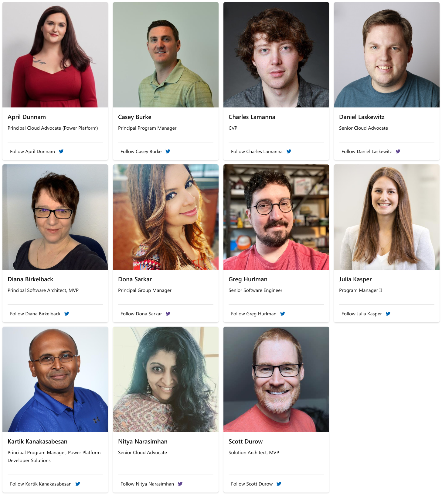

<head>
  <meta name="twitter:url" 
    content="https://microsoft.github.io/Low-Code/blog/slug-FIXME" />
  <meta name="twitter:title" 
    content="FIXME: Title Of Post" />
  <meta name="twitter:description" 
    content="FIXME: Post Description" />
  <meta name="twitter:image" 
    content="FIXME: Post Image" />
  <meta name="twitter:card" content="summary_large_image" />
  <meta name="twitter:creator" 
    content="@nitya" />
  <meta name="twitter:site" content="@AzureAdvocates" /> 
  <link rel="canonical" 
    href="https://microsoft.github.io/Low-Code/blog/slug-FIXME" />
</head>

Welcome to `Day 05` of #30DaysOfLowCode!

## What We'll Cover
 * Looking back on week 1
 * Self-study resources 
 * Looking forward to week 2

<!-- FIXME: banner image -->

<!-- ************************************* -->
<!--  AUTHORS: ONLY UPDATE BELOW THIS LINE -->
<!-- ************************************* -->

## Looking back on Week 1 
Wow, Low Code February is a hit! we're so excited to see **40k+** visits to the campaign and get **1400+** regs to the Cloud Skills Challenge in less than one week! We're super honored to create something that's loved by the community, and we also know that we couldn't have gone so far without the support from everyone of you who's reading this blog right now. THANK YOU! ❤️

Here's what we've done during week 1, don't miss a thing in your learning journey:
 
1. [**Cloud skills chellenge**](https://aka.ms/lowcode-february/challenge) - It's still not too late to join the challenge to learn about low-code and fusion teams fundamentals, as well as building amazing Power Platform solutions using pro-code tools and frameworks. Register today and get yourself on the leaderboard!

2. [**#30DaysOfLowCode**](https://aka.ms/lowcode-february/blog) - We have walked you through Power Platform foundamentals in amazing blogs from low-code 101 to developer stories that help you get a better taste of low-code for a code-first developer:
* 🥇 First time hearing low-code and wanted to learn how it helps in your day-to-day work? Read [**You say Low, I say Code!**](https://microsoft.github.io/Low-Code/blog/2023-day2) to get a quick intro into the low-code world. 
* 🆕 Never used Power Platform before? Read [**DevTools & Onboarding**](http://localhost:3000/Low-Code/blog/2023-day3) to get the full onboarding guidance.
* 🚀 Want to hear stories from your peers, and understand why more and more code-first developers have turned to low-code and embrace the technology in their daily work? Go check out the [**Developer Stories**](https://aka.ms/lowcode-february/blog/PowerForPros) posted by the amazing authors from our PM group at [**ZeroToHero**🚀](https://aka.ms/lowcode-february/0ToHero).

3. Do you know that the [**Powerful Dev Conf**](https://learn.microsoft.com/en-us/events/learn-events/powerful-devs-2023/?WT.mc_id=javascript-82212-ninarasi) is coming in a week on **Feb 15**? We have a great line up of speakers and some of the authors are going to present at the conference as well! [**Sign up**](https://learn.microsoft.com/en-us/events/learn-events/powerful-devs-2023/?WT.mc_id=javascript-82212-ninarasi) today if you haven't already.
 
 

## Self-study resources 
Don't have the time to follow day by day? Here're 3 self-study materials that you should know about to help you learn at your own pace: 
1. Resources: Check out the [**Collection**](https://aka.ms/lowcode-february/collection) that have links to documenation and trainings to help you go from Power Platform basics, to understanding data management, fusion teams and ALM 
2. Workshops: Check out the step by step [**Workshops**](https://aka.ms/lowcode-february/workshop) that helps you gain hands-on experience from intro to advanced, whereever you're in the learning path. 
3. Still have questions? Join our **Ask The Expert sessions!** Pick a time that works best for you and enjoy a face to face discussion with our leaderships:
* 1️⃣ [**Feb 23, 9AM PST**](https://aka.ms/ATE0223/RSVP ) - This Ask the Expert will be focused on answering questions from the Powerful Devs Conference on Feb 15th. The Powerful Devs Conference focuses on showcasing how code first developers can integrate with the Power Platform to innovate faster. We will have experts on hand to answer questions about full code and low code integration.
* 2️⃣ [**Mar 09, 9AM PST**](https://aka.ms/ATE0309/RSVP) - This Ask the Expert will answer your questions from Low Code February. Low Code February is a month-long, hands-on learning experience focused on showcasing how code-first developers can take advantage of the Power Platform and use their skills and tooling to extend low code solutions. We will have experts in code-first integration with the Power Platform live to answer questions related to the content and cloud skills challenge of the Low Code February event.

## Looking forward to week 2
Don't forget to bookmark the [**#30DaysOfLowCode**](https://aka.ms/lowcode-february/blog) page and come back tomorrow, where we will cover everything you need to know about Power Platform Backend Integrations in week 2. 

From utilizing built-in connectors to building custom connectors, integrating with backend data source, and creating serverless apps. We will showcase the latest functionalities we have, help you learn with tutorials, demos, and real world best practices that you can apply to your business immediately. 

