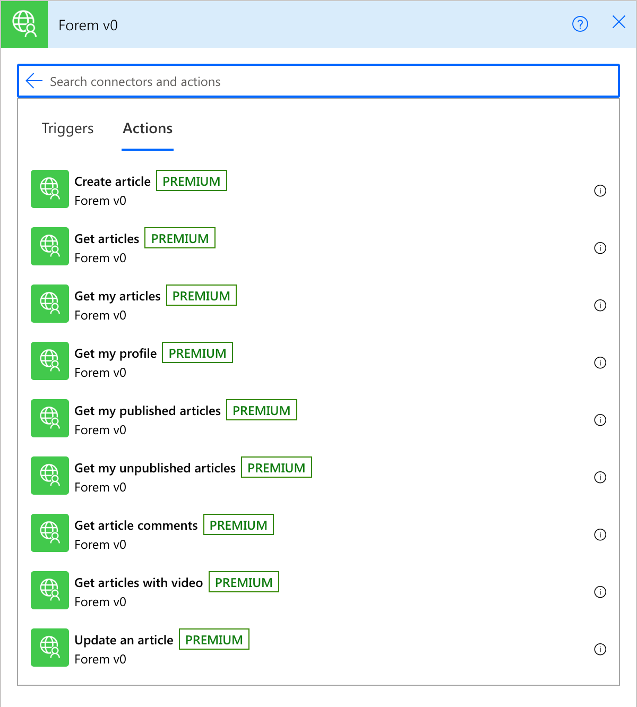
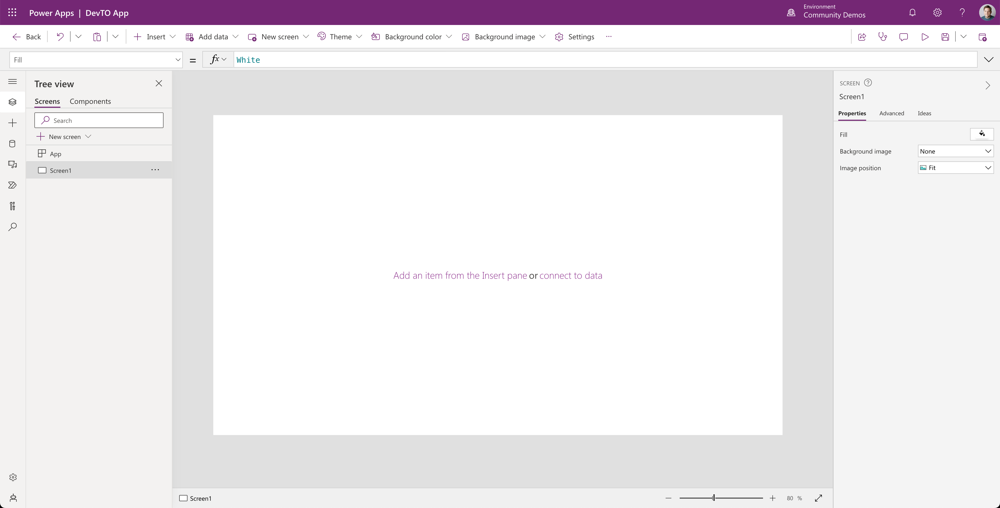

<head>
  <meta name="twitter:url"
    content="https://microsoft.github.io/Low-Code/blog/2023-day9-use" />
  <meta name="twitter:title"
    content="9. Build a Custom Connector" />
  <meta name="twitter:description"
    content="Want to build a Power Platform connector for an API? Or extend an existing one to support new capabilities? Join us on #30DaysOfLowCode to learn how - https://aka.ms/lowcode-february" />
  <meta name="twitter:image"
    content="https://microsoft.github.io/Low-Code/img/og/30-09-02.png" />
  <meta name="twitter:card" content="summary_large_image" />
  <meta name="twitter:creator"
    content="@nitya" />
  <meta name="twitter:site" content="@AzureAdvocates" />
  <link rel="canonical"
    href="https://microsoft.github.io/Low-Code/blog/2023-day9-use" />
</head>

Welcome to `Day 09` of #30DaysOfLowCode!

In the past few days, we've talked about Power Platform connectors, from built-in options, to their value in serverless computing solutions driven by automated workflows. But what if prebuilt connectors don't support _your_ target API? That's where custom connectors come in. Join us today as we take you step by step through the process of _building, and testing a custom connector!_

## What We'll Cover

* Motivation - Why are custom connectors needed?
* Scenario - Let's build a dev.to Connector!
* Process - Building from an OpenAPI specification
* Testing - Validate it works!
* **Exercise**: [Training: Build custom connectors for Power Automate](https://learn.microsoft.com/training/paths/build-custom-connectors/?WT.mc_id=javascript-82212-ninarasi&ns-enrollment-type=Collection&ns-enrollment-id=xz6ehr2mx031y0)
* **Resources**: Explore the [Low Code February Collection](https://aka.ms/lowcode-february/collection)

<!-- ************************************* -->
<!--  AUTHORS: ONLY UPDATE BELOW THIS LINE -->
<!-- ************************************* -->

In the [first part of the blog](part-1.md), Nitya showed you how to build a custom connector for the Forem v0 API. From now, I (Daniel) will take it over and show you what you can do with the custom connector in the Power Platform.

## Custom connectors in the Power Platform

When custom connectors are deployed, you will find them in multiple places. And, because the Power Platform is not just a bunch of products together, but also really advocates the 'better together' story, it gives you the possibility to even use data from the custom connector in places where the connector doesn't appear.

Let me explain that.

You can find custom connectors in Power Automate, where you can automate processes.

You can also find custom connectors in Power Apps. Power Apps is the product of the Power Platform where you build apps.

But, because the products work very well together, it's also possible to for instance:

* Trigger a Power Automate workflow from a Power BI visual
* Trigger a Power Automate workflow from a Power Virtual Agents chatbot
* Embed a Power App inside of a Power BI report/dashboard

Which gives you the possibility to use the connector in places even when they don't have a custom connector experience out of the box.

## Build a front end with Power Apps

Power Apps consists of multiple types of apps: canvas apps and model-driven apps. Canvas apps are the apps that give you the possibility to design them how you want. You have the possibility to change everything on the screen. You can even build Power Apps Component Framework components if you want to build your own components with custom code.

Model-driven apps are a different type of app. It's based on data. First, you start building your data model, and when you're done with that, you start building the forms and views in your app. Lastly, you create the app to pull it all together. It doesn't offer the design freedom canvas apps have, but it gives you a bunch of functionality out of the box in exchange for that. You have responsive design out of the box and you don't have to think much about the controls and formula's that canvas has, because it will do a lot of the heavy lifting for you.

In this blog, I will focus on building a canvas app, but I wanted to make sure everyone knew about both types of apps.

### Create a canvas app

In this blog, I'm not gonna talk about how to create a canvas app from scratch, because there is a [great Microsoft Learn article](https://learn.microsoft.com/power-apps/maker/canvas-apps/create-blank-app?WT.mc_id=power-82212-dlaskewitz) about that. For this example, I created a canvas app in tablet mode.

When you have created your canvas app in tablet mode, you will see Power Apps Studio:

Power Apps Studio is the place where you can design, build and manage your canvas app. If you want to learn more about all that you see here, make sure to check out [this article](https://learn.microsoft.com/power-apps/maker/canvas-apps/power-apps-studio) which gives you a great explanation about what all the parts of Power Apps Studio.

## Speed up development with the Creator Kit

There are tons of components available out of the box, like text inputs, date pickers, camera controls, etc. These controls offer you a lot of flexibility, but, if you want to make it yourself really easy, it's a good idea to use the [Creator Kit](https://learn.microsoft.com/power-platform/guidance/creator-kit/overview?WT.mc_id=power-82212-dlaskewitz). The Creator Kit is a solution which you can import into your environment. The solution contains a [set of components](https://learn.microsoft.com/power-platform/guidance/creator-kit/compontents?WT.mc_id=power-82212-dlaskewitz) that are based on the [Fluent UI framework](https://developer.microsoft.com/fluentui?WT.mc_id=power-82212-dlaskewitz).

There is excellent guidance on how to [install the Creator Kit](https://learn.microsoft.com/power-platform/guidance/creator-kit/setup?WT.mc_id=power-82212-dlaskewitz) and how to [use it within Power Apps](https://learn.microsoft.com/power-platform/guidance/creator-kit/creator-kit-explained?WT.mc_id=power-82212-dlaskewitz).

## Add the Forem v0 connector to your app

## Add the Creator Kit components to your app

## Publish your app

## Resources

* [**Create a canvas app from scratch**](https://learn.microsoft.com/power-apps/maker/canvas-apps/create-blank-app?WT.mc_id=power-82212-dlaskewitz)
* [**Creator Kit**](https://learn.microsoft.com/power-platform/guidance/creator-kit/overview?WT.mc_id=power-82212-dlaskewitz)
* [**Creator Kit components**](https://learn.microsoft.com/power-platform/guidance/creator-kit/compontents?WT.mc_id=power-82212-dlaskewitz)
* [**PowerfulDevs Session**](https://learn.microsoft.com/events/learn-events/powerful-devs-2023/?WT.mc_id=power-82212-dlaskewitz): Enable millions of low code devs by building custom connectors
* [**Learn Collection**](https://aka.ms/lowcode-february/collection) LowCode February

