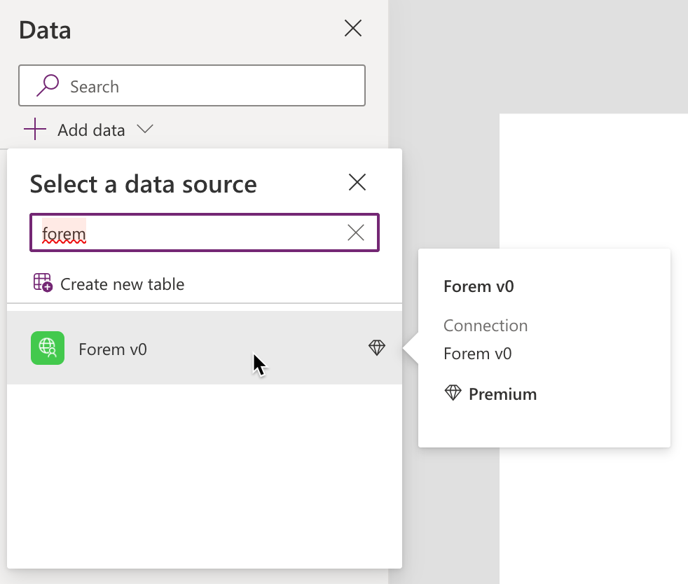
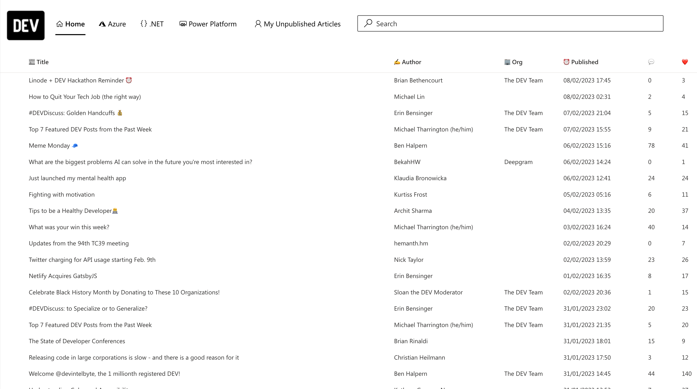
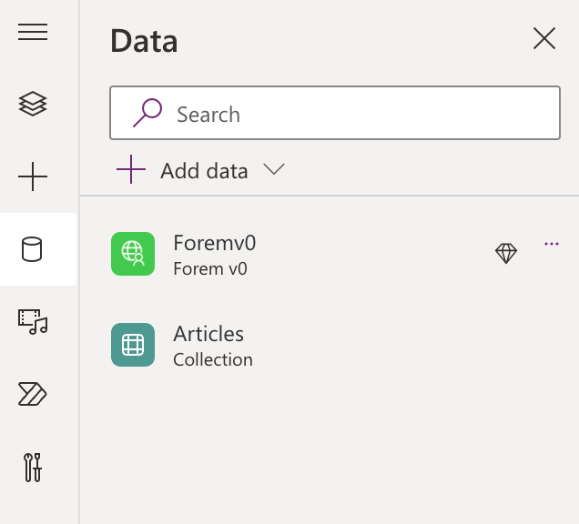
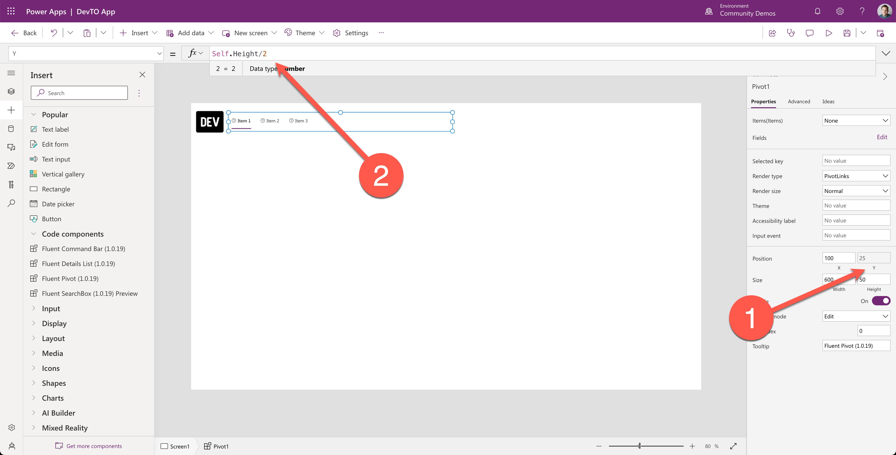
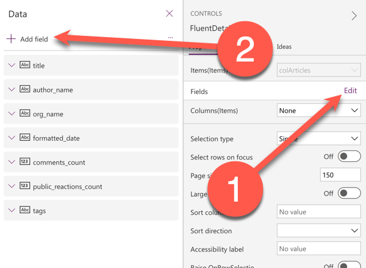

<head>
  <meta name="twitter:url"
    content="https://microsoft.github.io/Low-Code/blog/2023-day9-use" />
  <meta name="twitter:title"
    content="9b. Use the Custom Connector" />
  <meta name="twitter:description"
    content="Want to build a Power Platform connector for an API? Or extend an existing one to support new capabilities? Join us on #30DaysOfLowCode to learn how - https://aka.ms/lowcode-february" />
  <meta name="twitter:image"
    content="https://microsoft.github.io/Low-Code/img/og/30-09-02.png" />
  <meta name="twitter:card" content="summary_large_image" />
  <meta name="twitter:creator"
    content="@nitya" />
  <meta name="twitter:site" content="@AzureAdvocates" />
  <link rel="canonical"
    href="https://microsoft.github.io/Low-Code/blog/2023-day9-use" />
</head>

Welcome to `Day 09` of #30DaysOfLowCode!

In the [**first part of the blog**](part-1.md), Nitya showed you how to build a custom connector for the Forem v0 API. From now, I (Daniel) will take it over and show you what you can do with the custom connector in the Power Platform. 

If you don't want to follow the whole tutorial, but you **want to just see the solution**, make sure to go the the bottom of the page for a [**link to the resources**](#completed-solution) that you can import and explore on your own!

:::info SEE US LIVE AT POWERFUL DEVS!
Join us Feb 15 at the #PowerfulDevs conference where Daniel and Nitya will walk through the steps of building the connector and application - and more!
[**Register Here**](https://learn.microsoft.com/events/learn-events/powerful-devs-2023/?WT.mc_id=javascript-82212-ninarasi)
:::


## What We'll Cover

* Custom Connectors in the Power Platform
* Build a front end with Power Apps
* Speed up development with the Creator Kit
* Add the Forem v0 connector to your app
* Add the Creator Kit components to your app
* Publish your app
* Completed solution


<!-- ************************************* -->
<!--  AUTHORS: ONLY UPDATE BELOW THIS LINE -->
<!-- ************************************* -->

## Custom connectors in the Power Platform

When custom connectors are deployed, you will find them in multiple places. And, because the Power Platform is not just a bunch of products together, but also really advocates the 'better together' story, it gives you the possibility to even use data from the custom connector in places where the connector doesn't appear.

Let me explain that: You can find custom connectors in Power Automate, where you can automate processes.


You can also find custom connectors in Power Apps. Power Apps is the product of the Power Platform where you build apps.



But, because the products work very well together, it's also possible to for instance:

* Trigger a Power Automate workflow from a Power BI visual
* Trigger a Power Automate workflow from a Power Virtual Agents chatbot
* Embed a Power App inside of a Power BI report/dashboard

Which gives you the possibility to use the connector in places even when they don't have a custom connector experience out of the box.

## Build a front end with Power Apps

Power Apps consists of multiple types of apps: canvas apps and model-driven apps. Canvas apps are the apps that give you the possibility to design them how you want. You have the possibility to change everything on the screen. You can even build Power Apps Component Framework components if you want to build your own components with custom code.

Model-driven apps are a different type of app. It's based on data. First, you start building your data model, and when you're done with that, you start building the forms and views in your app. Lastly, you create the app to pull it all together. It doesn't offer the design freedom canvas apps have, but it gives you a bunch of functionality out of the box in exchange for that. You have responsive design out of the box and you don't have to think much about the controls and formula's that canvas has, because it will do a lot of the heavy lifting for you.

In this blog, I will focus on building a canvas app, but I wanted to make sure everyone knew about both types of apps.

### Create a canvas app

In this blog, I'm not gonna talk about how to create a canvas app from scratch, because there is a [great Microsoft Learn article](https://learn.microsoft.com/power-apps/maker/canvas-apps/create-blank-app?WT.mc_id=power-82212-dlaskewitz) about that. For this example, I created a canvas app in tablet mode.

When you have created your canvas app in tablet mode, you will see Power Apps Studio:


Power Apps Studio is the place where you can design, build and manage your canvas app. If you want to learn more about all that you see here, make sure to check out [this article](https://learn.microsoft.com/power-apps/maker/canvas-apps/power-apps-studio) which gives you a great explanation about what all the parts of Power Apps Studio.

## Speed up development with the Creator Kit

There are tons of components available out of the box, like text inputs, date pickers, camera controls, etc. These controls offer you a lot of flexibility, but, if you want to make it yourself really easy, it's a good idea to use the [Creator Kit](https://learn.microsoft.com/power-platform/guidance/creator-kit/overview?WT.mc_id=power-82212-dlaskewitz). The Creator Kit is a solution which you can import into your environment. The solution contains a [set of components](https://learn.microsoft.com/power-platform/guidance/creator-kit/components?WT.mc_id=power-82212-dlaskewitz) that are based on the [Fluent UI framework](https://developer.microsoft.com/fluentui?WT.mc_id=power-82212-dlaskewitz).

There is excellent guidance on how to [install the Creator Kit](https://learn.microsoft.com/power-platform/guidance/creator-kit/setup?WT.mc_id=power-82212-dlaskewitz) and how to [add the code components to a canvas app](https://learn.microsoft.com/power-platform/guidance/creator-kit/creator-kit-explained?WT.mc_id=power-82212-dlaskewitz#learn-how-to-add-components-to-an-app).

In the app, I use the following code components:

* Details list ([link](https://learn.microsoft.com/power-platform/guidance/creator-kit/detailslist))
* Pivot ([link](https://learn.microsoft.com/power-platform/guidance/creator-kit/pivot))
* Search box ([link](https://learn.microsoft.com/power-platform/guidance/creator-kit/searchbox))

The end result will look like this:



## Add the Forem v0 connector to your app

To work with the forem connector, you first need to add that to your app. Go to Power Apps Studio and select the `Data` icon in the left menu. Next, add the connector to your app by selecting the `Add data` button. Search for `Forem` and click on your custom connector. If you already have a connection, feel free to select that. If not, add a connection here by adding the API key you need for the [Forem API](https://developers.forem.com/api/v1#getting-an-api-key).

After connecting the custom connector to your app, the data tab should look like this:



To test out if the connector works, we can easily create a collection (local data that's saved in the app) by going to the tree view (layers icon in the left menu), selecting `App` and changing the `OnStart` property to:

```powerappsfl
ClearCollect(
    Articles, 
    Foremv0.GetArticles(
      { 
        page: 1, 
        per_page: 100
      }
    )
)
```

This `ClearCollect` formula will create a collection with the name _Articles_. The collection will be filled with whatever comes next. In this case, it's a call to the custom connector `Foremv0` and specifically, a call to the `GetArticles` action in the connector. Inside of the call, the parameters `page` and `per page` are used to make sure we get 100 items returned.

## Add the Creator Kit components to your app

In the earlier chapter, I already wrote about installing and using the Creator Kit. To build this app, you should have the following code components added to your app:


If you don't have those code components available make sure to add them like described in [the documentation](https://learn.microsoft.com/power-platform/guidance/creator-kit/creator-kit-explained?WT.mc_id=power-82212-dlaskewitz#learn-how-to-add-components-to-an-app).

Let's start building the app!

First, let's make sure our app `OnStart` property has the right content. The `OnStart` property of the app should have a couple of formulas:

```csharp
Set(
    AppTheme,
    {
        palette: {
            themePrimary: "#000000",
            themeLighterAlt: "#898989",
            themeLighter: "#737373",
            themeLight: "#595959",
            themeTertiary: "#373737",
            themeSecondary: "#2f2f2f",
            themeDarkAlt: "#252525",
            themeDark: "#151515",
            themeDarker: "#0b0b0b",
            neutralLighterAlt: "#faf9f8",
            neutralLighter: "#f3f2f1",
            neutralLight: "#edebe9",
            neutralQuaternaryAlt: "#e1dfdd",
            neutralQuaternary: "#d0d0d0",
            neutralTertiaryAlt: "#c8c6c4",
            neutralTertiary: "#595959",
            neutralSecondary: "#373737",
            neutralPrimaryAlt: "#2f2f2f",
            neutralPrimary: "#000000",
            neutralDark: "#151515",
            black: "#0b0b0b",
            white: "#ffffff"
        }
    }
);
```

The above formula sets the `AppTheme` variable we are going to use in the Creator Kit components. The last part of the OnStart property should be as follows:

```csharp
ClearCollect(
    colArticles,
    SortByColumns(
        AddColumns(
            Foremv0.GetArticles(
                {
                    page: 1,
                    per_page: 1000,
                    tags:"powerplatform, powerapps, dotnet, azure"
                }
            ),
            "author_name",
            user.name,
            "org_name",
            organization.name,
            "formatted_date",
            Text(
                DateTimeValue(
                    Substitute(
                        published_at,
                        "Z",
                        ""
                    )
                ),
                ShortDateTime
            )
        ),
        "created_at",
        Descending
    )
)
```

The above `ClearCollect` formula creates a collection called `colArticles`. The `GetArticles` action of the custom connector will be used to grab the last 1000 articles with the tags `powerplatform, powerapps, dotnet, azure`. Wrapped around that call we have two other formulas: the `Addcolumns` formula to flatten the result of the API and add some columns, and the `SortByColumns` formula to sort the articles by created date.

That's it for our app `OnStart` formula. Next, let's create the header. The header consists of the following three parts:

* Logo (image)
* Pivot (pivot from the Creator Kit)
* SearchBox (search box from the Creator Kit)

### Logo

For the logo, click on the `plus` icon on the left side, which opens up the `Insert` menu. Search for _image_ in the search box. Click on `Image` that shows up in the insert menu. At the right side of your screen you can see the properties of your control. This is where you can find properties, like in this case the property `Image`, which enables you to upload an image or choose one that's already added to your app. Click on the dropdown next to `Image` where it shows `None` and add an image file. I added the dev.to logo here, since this app will connect to dev.to.

Drag your image to the top-left of the screen and make sure to add a padding of `10` to the top, bottom, left & right of the image.

This should result in properties looking like this (changed properties in red):


### Pivot

Next, add the `Fluent Pivot` component via the `Insert` menu. Set the `X` property to `100`, the `Height` property to `50` and the `Width` property to `600`. For the `Y` property, we will use a different way of changing a property. For this we have to:

1. Press the `Y` in the properties panel of the Pivot component
1. Change the value of the `Y` property to `Self.Height/2` in the formula bar.



This will place the pivot on the right side of the dev.to logo you just added. Change the `Theme` property to `AppThemeJson` so that it will get the theme you have set in the app `OnStart`.

Now we have a pivot, but it doesn't do anything. To change this we need to change the following properties:

* **Items**:

Change this property to the following table:

```csharp
Table(
    {
        ItemKey: "Home",
        ItemDisplayName: "Home",
        ItemIconName: "Home"
    },
    {
        ItemKey: "Azure",
        ItemDisplayName: "Azure",
        ItemIconName: "AzureLogo"
    },
    {
        ItemKey: "DotNet",
        ItemDisplayName: ".NET",
        ItemIconName: "Code"
    },
    {
        ItemKey: "PowerPlatform",
        ItemDisplayName: "Power Platform",
        ItemIconName: "PowerApps"
    },
    {
        ItemKey: "MyUnpublishedArticles",
        ItemDisplayName: "My Unpublished Articles",
        ItemIconName: "Contact"
    }
)
```

This table contains a couple of items, which all have three properties:

1. `ItemKey` - this is the internal key of the item, we will use it later on in the OnSelect to find out which item has been selected.
1. `ItemDisplayName` - this is the name that will be displayed in the pivot.
1. `ItemIconName` - this is the icon name that will be displayed in the pivot.

For more info on the workings of the pivot, go to [the documentation](https://learn.microsoft.com/power-platform/guidance/creator-kit/pivot?WT.mc_id=power-82212-dlaskewitz).

* **SelectedKey**

Change this property in the formula bar to the following:

```csharp
Self.Selected.ItemKey
```

This setting will make sure the pivot component will show a line below the currently selected item.

* **OnSelect**

```csharp
Switch(
    Self.SelectedKey,
    "Azure",
    ClearCollect(
        colArticles,
        SortByColumns(
            AddColumns(
                Foremv0.GetArticles(
                    {
                        page: 1,
                        per_page: 1000,
                        username: "azure"
                    }
                ),
                "author_name",
                user.name,
                "org_name",
                organization.name,
                "formatted_date",
                Text(
                    DateTimeValue(
                        Substitute(
                            published_at,
                            "Z",
                            ""
                        )
                    ),
                    ShortDateTime
                )
            ),
            "created_at",
            Descending
        )
    ),
    "DotNet",
    ClearCollect(
        colArticles,
        SortByColumns(
            AddColumns(
                Foremv0.GetArticles(
                    {
                        page: 1,
                        per_page: 1000,
                        tag: "dotnet"
                    }
                ),
                "author_name",
                user.name,
                "org_name",
                organization.name,
                "formatted_date",
                Text(
                    DateTimeValue(
                        Substitute(
                            published_at,
                            "Z",
                            ""
                        )
                    ),
                    ShortDateTime
                )
            ),
            "created_at",
            Descending
        )
    ),
    "Home",
    ClearCollect(
        colArticles,
        SortByColumns(
            AddColumns(
                Foremv0.GetArticles(
                    {
                        page: 1,
                        per_page: 1000,
                        tags: "powerplatform, powerapps, dotnet, azure"
                    }
                ),
                "author_name",
                user.name,
                "org_name",
                organization.name,
                "formatted_date",
                Text(
                    DateTimeValue(
                        Substitute(
                            published_at,
                            "Z",
                            ""
                        )
                    ),
                    ShortDateTime
                )
            ),
            "created_at",
            Descending
        )
    ),
    "MyUnpublishedArticles",
    ClearCollect(
        colArticles,
        Foremv0.GetMyUnpublishedArticles()
    ),
    "PowerPlatform",
    ClearCollect(
        colArticles,
        SortByColumns(
            AddColumns(
                Foremv0.GetArticles(
                    {
                        page: 1,
                        per_page: 1000,
                        tag: "powerplatform"
                    }
                ),
                "author_name",
                user.name,
                "org_name",
                organization.name,
                "formatted_date",
                Text(
                    DateTimeValue(
                        Substitute(
                            published_at,
                            "Z",
                            ""
                        )
                    ),
                    ShortDateTime
                )
            ),
            "created_at",
            Descending
        )
    )
)
```

The above formula is very long, this is because here I use a `Switch` formula to have different behavior per selected item. In this case, you can see that when the item with the `MyUnpublishedArticles` key is selected, it's doing a different call (GetMyUnpublishedArticles) than when the item with the `PowerPlatform` key is selected (GetArticles, with tag parameter with the value powerplatform). The rest of the item selections are pretty much the same.

### Search Box

Let's add the `Fluent SearchBox` component via the `Insert` menu. Set the following properties:

|Property|Value|
|--------------|-----------|
|Theme|AppThemeJson|
|X|700|
|Y|30|
|Width|600|
|Height|30|

Now, we are done with the header. Let's move on with the details list, which we'll use to show all the articles.

### Details List

The details list is where all the articles are shown. Add the `Fluent Details List`. Set the following properties:

|Property|Value|
|--------------|-----------|
|Theme|AppThemeJson|
|X|0|
|Y|140|
|Width|1366|
|Height|628|

Now the details list has the right dimensions and position, but it doesn't have the right content and settings, for that we need to change the following properties:

* **OnChange**:

The following formula is documented in the documentation of the [details list](https://learn.microsoft.com/power-platform/guidance/creator-kit/detailslist#manual-sorting). This is to make sure the local collection can be sorted the way we want to sort it.

```csharp
If(Self.EventName="Sort", 
UpdateContext({
                ctxSortCol:Self.SortEventColumn,
                ctxSortAsc:If(Self.SortEventDirection='PowerCAT.FluentDetailsList.SortEventDirection'.Ascending,true,false)
 })
);
```

* **Items**:

In the `Items` property, use an `if` condition to make sure our search box works. In this case, the `if` condition checks if the length of the SearchText in the search box is greater than or equal than 3. If that's the case, a `Search()` formula will be kicked off, that will search within the `colArticles` collection for the title, tags and the author name. If a match is found, it will show it in the details list. If not, the details list will become empty.

If the condition is not met, it will show just the `colArticles`. In both cases it will perform sorting as well.

```csharp
If(
    Len(SearchBox1.SearchText) >= 3,
    SortByColumns(
        Search(
            colArticles,
            SearchBox1.SearchText,
            "title",
            "tags",
            "author_name"
        ),
        ctxSortCol,
        If(
            ctxSortAsc,
            SortOrder.Ascending,
            SortOrder.Descending
        )
    ),
    SortByColumns(
        colArticles,
        ctxSortCol,
        If(
            ctxSortAsc,
            SortOrder.Ascending,
            SortOrder.Descending
        )
    )
)
```

* **Fields**:



Select the `edit` button next to the `Fields` property and click `Add field`. Make sure to add the following fields:

* title
* author_name
* org_name
* formatted_date
* comments_count
* public_reactions_count
* tags

Now we have the fields available to us, but they don't show yet in the details list. For that, we need to change the `Columns` property.

* **Columns**:

Add the following formulas to the `Columns` property:

```c#
Switch(
    Pivot1.Selected.ItemKey,
    "MyUnpublishedArticles",
    Table(
        {
            ColDisplayName: "📰 Title",
            ColName: "title",
            ColBold: true,
            ColWidth: Parent.Width-100,
            ColRowHeader: true,
            ColResizable: true
        }
    ),
    Table(
        {
            ColDisplayName: "📰 Title",
            ColName: "title",
            ColBold: true,
            ColWidth: 700,
            ColRowHeader: true,
            ColResizable: true
        },
        {
            ColDisplayName: "✍️ Author",
            ColName: "author_name",
            ColResizable: true,
            ColWidth: 200,
            ColRowHeader: true
        },
        {
            ColDisplayName: "🏢 Org",
            ColName: "org_name",
            ColResizable: true,
            ColWidth: 100,
            ColRowHeader: true
        },
        {
            ColDisplayName: "⏰ Published",
            ColName: "formatted_date",
            ColResizable: true,
            ColWidth: 150,
            ColRowHeader: true
        },
        {
            ColDisplayName: "💬",
            ColName: "comments_count",
            ColResizable: true,
            ColSortable: true,
            ColWidth: 50,
            ColRowHeader: true
        },
        {
            ColDisplayName: "❤️",
            ColName: "public_reactions_count",
            ColResizable: true,
            ColSortable: true,
            ColWidth: 50,
            ColRowHeader: true
        },
        {
            ColDisplayName: "🏷️",
            ColName: "tags",
            ColWidth: 250,
            ColFirstMultiValueBold: true,
            ColMultiValueDelimiter: " "
        }
    )
)
```

The above formulas ensure that when the "MyUnpublishedArticles" item is selected in the pivot, it only shows the title column. If that item is not selected, it will show a lot more columns. All the columns are added to a table in both cases, and have properties like:

* ColDisplayName: the display name of the column
* ColName: the name of the field
* ColBold: if the column needs to be bold or not
* ColWidth: the width of the column

If you want to know all possible properties, make sure to check out the [docs](https://learn.microsoft.com/power-platform/guidance/creator-kit/detailslist#columns-properties?WT.mc_id=power-82212-dlaskewitz).

## Publish your app

With that, our app is ready for publishing. Select the save icon on the top right corner of the screen or use the `ctrl + S` or `cmd + S` shortcut to save your app. Publish your app by selecting the icon in the top right corner of the screen or use the `ctrl + shift + P` or `cmd + shift + P` shortcut to save your app.

There's also a share icon in the same row as the save and publish icons. You can use that to share the app with your colleagues:


## Completed solution

The custom connector and the canvas app are available as a solution via [this link](../../../../resources/custom-connector-solution/Forem_1_0_0_0.zip). You can import the solution via the import solution functionality that is described [here](https://learn.microsoft.com/power-apps/maker/data-platform/import-update-export-solutions).

And that also concludes this blog, hopefully this helps you when you start developing with Power Apps. Don't forget to check out the resources below!

## Resources

* [**Create a canvas app from scratch**](https://learn.microsoft.com/power-apps/maker/canvas-apps/create-blank-app?WT.mc_id=power-82212-dlaskewitz)
* [**Creator Kit**](https://learn.microsoft.com/power-platform/guidance/creator-kit/overview?WT.mc_id=power-82212-dlaskewitz)
* [**Creator Kit components**](https://learn.microsoft.com/power-platform/guidance/creator-kit/components/?WT.mc_id=power-82212-dlaskewitz)
* [**PowerfulDevs Session**](https://learn.microsoft.com/events/learn-events/powerful-devs-2023/?WT.mc_id=power-82212-dlaskewitz): Enable millions of low code devs by building custom connectors
* [**Learn Collection**](https://aka.ms/lowcode-february/collection) LowCode February


