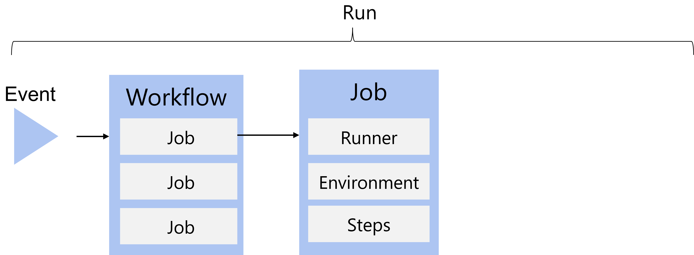
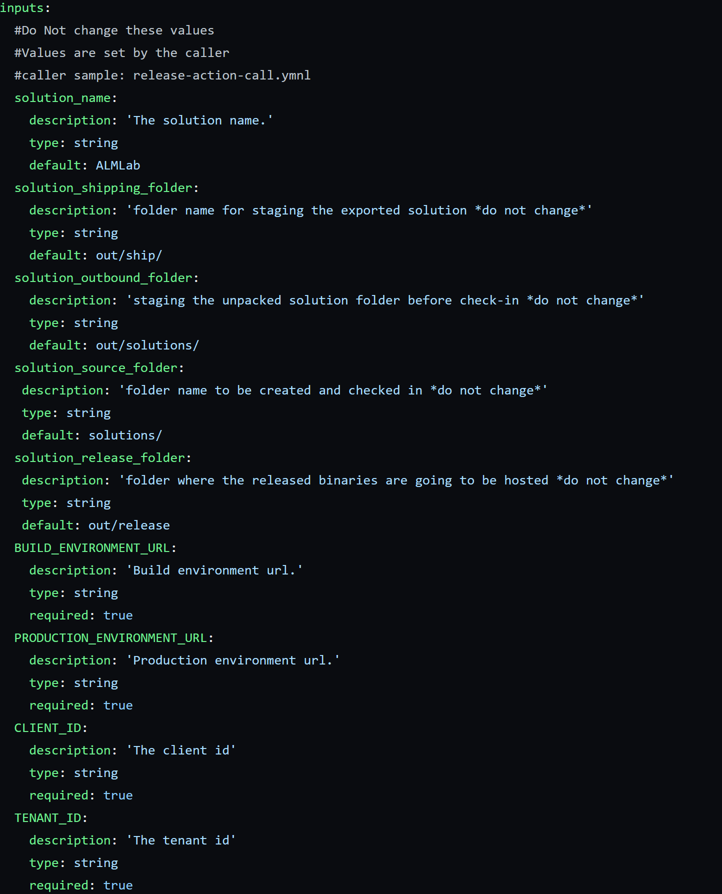

<head>
  <meta name="twitter:url" 
    content="https://microsoft.github.io/Low-Code/blog/slug-FIXME" />
  <meta name="twitter:title" 
    content="FIXME: Title Of Post" />
  <meta name="twitter:description" 
    content="FIXME: Post Description" />
  <meta name="twitter:image" 
    content="FIXME: Post Image" />
  <meta name="twitter:card" content="summary_large_image" />
  <meta name="twitter:creator" 
    content="@nitya" />
  <meta name="twitter:site" content="@AzureAdvocates" /> 
  <link rel="canonical" 
    href="https://microsoft.github.io/Low-Code/blog/slug-FIXME" />
</head>

Welcome to `Day #FIXME` of #28DaysOfLowCode!

The theme for this week is #FIXME. Yesterday we talked about #FIXME. Today we'll explore the topic of #FIXME.

## What We'll Cover
 * Section 1
 * Section 2
 * Section 3
 * Section 4
 * Exercise: Try this yourself!
 * Resources: For self-study!

<!-- FIXME: banner image -->

<!-- ************************************* -->
<!--  AUTHORS: ONLY UPDATE BELOW THIS LINE -->
<!-- ************************************* -->

## Basic GitHub actions Concept
Before we get into details on the Power Platform GitHub actions, we need to understand some key terms of GitHub, that enable GitHub to do Continuous Integration/Continuous Delivery (CI/CD).

GitHub actions are component to enable CI/CD of Power Platform Applications using GitHub Workflows.
GitHub Run      : GitHub run is a term used when the workflow runs 
GitHub Workflow : This is the actual CI/CD script that is used by GitHub and it consists of Jobs
GitHub Job      : A Job is a composition of a GitHub Runner (container where the CI/CD script is run)
GitHub Steps    : Step has a set of actions that accomplish an the overall outcome of the workflow (such as deploying to Power Platform)

The GitHub actions for Power Platform are available at the GitHub market place. The GitHub actions, provide the ability to import export solutions, deploying to different environments, provisioning and decommissioning an environments, and validate the solution when it is being imported into a target environment.

## GitHub Runners
Runners in GitHub are a type of machine where you need to run your GitHub job on. Runners can GitHub hosted or self-hosted. 
GitHub hosted runners are managed by GitHub and all you need to do is to use *runs-on* and GitHub will automatically allocate such a resource during the runtime of a CI/CD script. 

Self-hosted Runners run on your identified resources such as VMs in the Azure Cloud or On-premises. This runners are configured and controlled based on your needs, as in you have more control on the kind of operating system version, pre-installed software tools that need to install for your CI/CD script to run.

Power Platform Actions on GitHub, support Windows and Linux images for both GitHub hosted and self-hosted runners. 

## How to connect to Power Platform environments using GitHub Actions? 
Power Platform Actions for GitHub have support for the following: 
- UserName/Password : Generic connection which uses username and password to authenticate to the Power Platform environments. Please do not enable MFAs this account otherwise your GitHub workflows will break
- Service Principal and Client secret (Recommended) - This allows your workflow to authenticate to the Power Platform using a service principal identity with a client secret. This is an approach we generally recommend when deploying Power Platform applications at scale.
## Use Environment Variables within GitHub workflow scripts when deploying Power Platform applications
If you want to use the same workflow to deploy multiple Power Platform solution to either one environment or different environments. 
GitHub Workflows support environment variables. 

Once you have the environments in place you can then call these environment variables from within the actions

## Exercise
Try out our Hands on lab for [GitHub actions](https://github.com/microsoft/powerplatform-actions-lab)

## Resources
- [**Get the GitHub actions from the GitHub marketplace**](https://github.com/marketplace/actions/powerplatform-actions)
- [**Self hosted runner information**](https://docs.github.com/en/actions/hosting-your-own-runners/about-self-hosted-runners)
- [**About GitHub hosted runners**](https://docs.github.com/en/actions/using-github-hosted-runners/about-github-hosted-runners)
- [**Azure AD service principal**](https://learn.microsoft.com/en-us/azure/active-directory/develop/howto-create-service-principal-portal)
- [**GitHub Power Platform Actions tutorial**](https://learn.microsoft.com/en-us/power-platform/alm/tutorials/github-actions-start?source=recommendations)
- [**GitHub Power Platform Actions: Hands on lab**](https://github.com/microsoft/powerplatform-actions-lab)
- 

