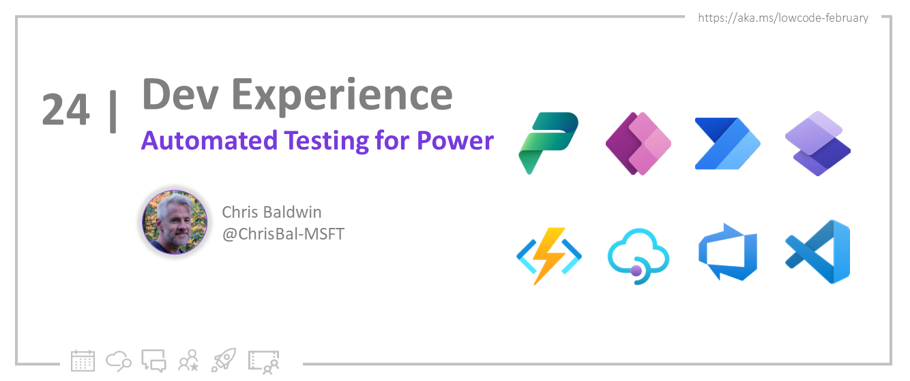
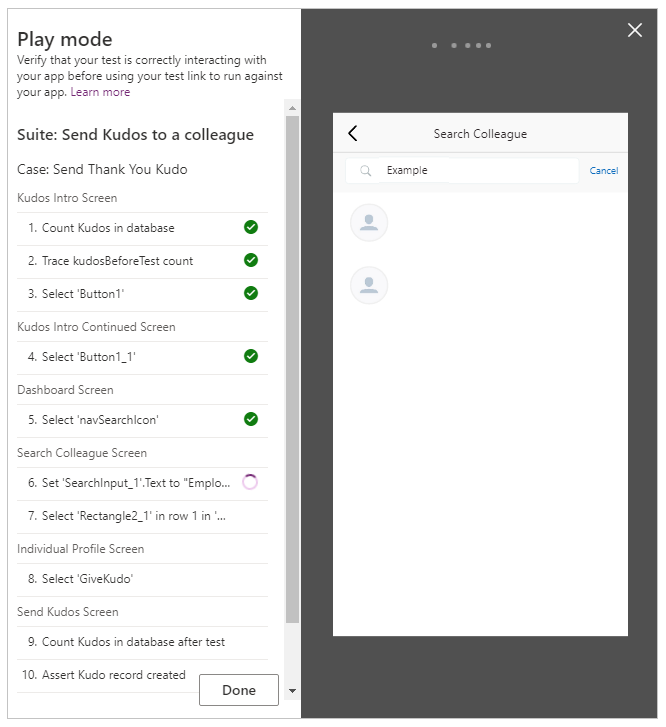
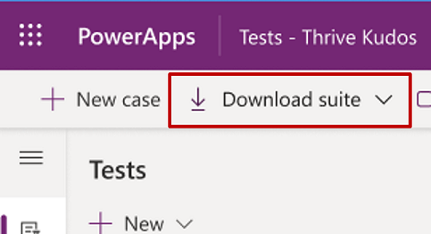

<head>
  <meta name="twitter:url" 
    content="https://microsoft.github.io/Low-Code/img/og/30-24.png" />
  <meta name="twitter:title" 
    content="24. Power Apps & Automated Testing" />
  <meta name="twitter:description" 
    content="Learn how to use right selection of tools to support good testing practices to manage app lifecycle for Power Apps - join us at #LowCodeFebruary and #30daysoflowcode https://aka.ms/lowcode-february" />
  <meta name="twitter:image" 
    content="https://microsoft.github.io/Low-Code/img/og/30-24.png" />
  <meta name="twitter:card" content="summary_large_image" />
  <meta name="twitter:creator" 
    content="@nitya" />
  <meta name="twitter:site" content="@AzureAdvocates" /> 
  <link rel="canonical" 
    href="https://microsoft.github.io/Low-Code/img/og/30-24.png" />
</head>

Welcome to `Day 24` of #30DaysOfLowCode!

## What We'll Cover
 * Why automated testing is important
 * Tools available today to test your Power Apps
 * Plans and investments in this area
 * **Resources**: Explore the [**Low Code February Collection**](https://aka.ms/lowcode-february/collection)
 * **Activity**: [**Sign up**](https://aka.ms/lowcode-february/devplan) for the **free** Power Apps Developer Plan.

<!-- FIXME: banner image -->

<!-- ************************************* -->
<!--  AUTHORS: ONLY UPDATE BELOW THIS LINE -->
<!-- ************************************* -->

## Why automated testing is important
Automated testing is an important part of the app lifecycle. Our goal is to provide customers with the right selection of tools to support good testing practices. Customers often start with manual testing when apps are in their earlier stages.  But, we hear about customers who strive to introduce automated testing into their overall workflows and processes once they reach these inflection points:

* **As apps grow in complexity** - As usage increases and makers respond to more and more feature requests in their apps, complexity grows as well.  Maybe an app calls out to an external API or has extensive Power Fx logic within it.  These are pieces that all must work together to ensure the proper functioning of your app, so it's important to make sure that they all come together to provide value from the end-user's perspective.

* **As collaborators get involved** - Collaboration is key, but the more cooks in the kitchen you have the more things can change unexpectedly.  How can you best ensure that when multiple people are collaborating on an app that changes don't introduce instability and other uenxpected behavior?  Running automated tests when changes are made can help ensure that apps stay functional when their are multiple collaobrators. 
* **As apps become more business critical** - More and more customers are trusting Power Apps with business critical processes.  Simply put, if the app doesn't function then core business processes or functions may also be impacted.  Automated testing can help to ensure continuity of the app functionality upon which your business processes depend.  And, better stability can lead to increased end user trust and satisfaction when using apps.

Let's take a look at what's available.

## Tools available today to test your Power Apps

There are a set of tools available today that you can use to test your apps.  

### Test Studio

Power Apps Test Studio is low-code solution to organize, record, and automate tests for canvas apps.  Test Studio features the following capabilities:
* **Test step recorder** - Test Studio includes recording capabilities.  When you start the recorder, you can interact with the app as you expect your end users will. Test Studio will record your interactions as test steps.

* **Test editor** - Once you've recorded test steps with Test Studio, the next step is to add your custom assertions. You can use the Test Studio UI to insert the assertions where they make sense in your app's flow.
  

* **Test playback** - Test Studio can be run in Studio by pressing Play. If any of the assert statements you configured in the previous step were to fail, the test step will fail and you will be shown the error. or it can be integrated into CI/CD flows by following these instructions: [Automate tests with Azure Pipelines using YAML](https://learn.microsoft.com/power-apps/maker/canvas-apps/test-studio-yaml-pipeline?WT.mc_id=javascript-82212-ninarasi)

  

### Test Engine
Test Engine is an evolution of our Power Apps testing tools. Test Engine builds upon the key use cases of Test Studio, but takes it in a new, powerful direction through open source collaboration and use of the Playwright browser testing platform. The goals of Test Engine are to provide customers with a robust testing platform for all types of Power Apps, and to make it super easy to integrate automated testing into your app development processes.

A lot more information about Test Engine can be found in the blog post [Introducing Test Engine: An open platform for automated testing of canvas apps](https://powerapps.microsoft.com/blog/introducing-test-engine-an-open-platform-for-automated-testing-of-canvas-apps/)

  

Test Engine supports canvas apps today, with support for model-driven apps to come in the future.  Some of the key benefits of Test Engine are:

* **Power Fx test authoring** - Test steps are written in familiar Power Fx, without the need for a pro-code solution using C#, JavaScript, or other complex code.
* **Connector mocking** - You can simulate the response your app receives from custom connectors.  This can be useful if you app hits an endpoint that has side effects, like inserting rows into Dataverse tables or kicking off Flows.
* **Screenshot function and video recording** - This lets you grab screenshots and video recordings of unattended test runs.  This will capture exactly what the user would see if they were interacting with the app.  This makes it easy to debug and follow up on test failures.
* **Robust, stable tests** - Test Engine has a special set of capabilities that abstract the app's browser DOM from you.  This means you create your tests by referencing the controls that you define at design-time, and you never need to worry about the specific output structure of the app in the browser.  Our goal here is that your tests should never break or need updating unless you make changes yourselves to the app being tested.
* **Reuse Test Studio tests** - If you want to reuse any tests you have recorded using Test Studio, you can export the test plan files for reuse in Test Engine by clicking the Download suite button:

  

## Plans and investments in automated testing
We are investing in this area and are working on a couple key things in this area:

* CI/CD integration - Our goal is to make it as easy as possible for you to integrate Test Engine into your CI/CD tools and make functional testing a regular, robust part of your app development process.  We are integrating Test Engine into the PAC CLI toolset to make it easy to use (so you will not have to build and run the Test Engine GitHub project), and we will be building Azure DevOps Pipelines and GitHub Actions support as well.  We hope that by integrating more tightly into this tooling, we will make automated testing a no brainer for your organization.
* Model-driven app support - As stated before, Test Engine and Test Studio support canvas apps today.  We want to build support for model-driven apps so that you have one set of comprehensive tools that will work with all of your Power Apps.
* Low-code recording enhancements - Eventually, we want to bring the ease of test case recording that customers have in Test Studio to Test Engine. We would love to hear your feedback around what we should be prioritizing to make it easier to create test plans for your apps.

## Resources
* **Try out Test Engine** - [Visit the Test Engine GitHub project](https://github.com/microsoft/PowerApps-TestEngine#getting-started)
* **Let us know any issues or feedback** - [GitHub issues for Test Engine](https://github.com/microsoft/PowerApps-TestEngine#getting-started)
* **Let us know any general feedback about test tools** - [Test Studio discussion thread](https://powerusers.microsoft.com/t5/Building-Power-Apps/Power-Apps-Test-Studio-Feedback-discussion-thread/td-p/455051)
