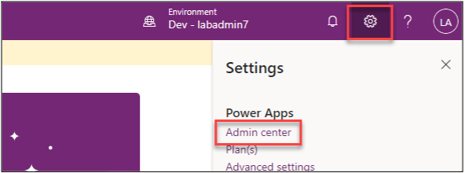
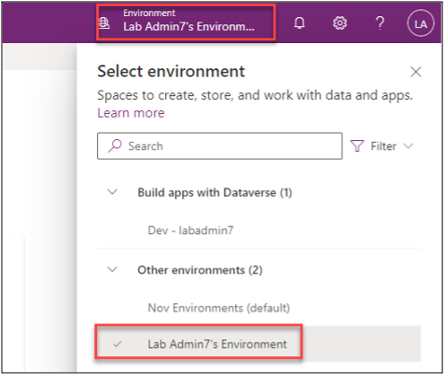
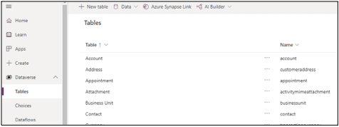

:::info LAB SCENARIO

You are member of the PrioritZ Fusion Team. As part of your onboarding, you will be setting up your Power Platform developer environment. You will also install Visual Studio Code, and the Power Platform CLI.

In **Exercise 1** you will will create a Power Platform developler environment. You will do all the development work for this course in this environment.

🚨 Note: Do not use an existing environment.
:::

## 1.1 Power Apps Developer Plan

1. Navigate to [**Power Apps Developer Plan**](https://aka.ms/lowcode-february/devplan/)

2. Select Add a dev environment.

3. Sign in if prompted.
4. Select your country and click **Accept**.
5. You should be navigated back to the maker portal.

## 1.2 Power Apps Admin Center

6. Click **Settings** and select **Admin center**.

7. Wait for the dev environment to be created.

8. Refresh until the status changes to **Ready**.

## 1.3 Power Apps Maker Portal

9. Go back to the [**Maker Portal**](https://aka.ms/lowcode-february/makerportal) refresh the page if you already have it open.
10. Click on the environment name and select the dev environment you created.

11. Expand **Dataverse** and select **Tables**.
12. You should see several Dataverse tables that are created with every environment.

