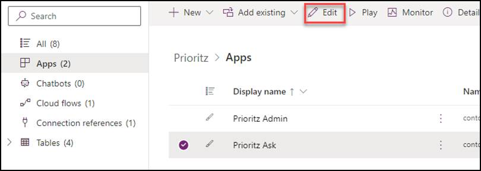
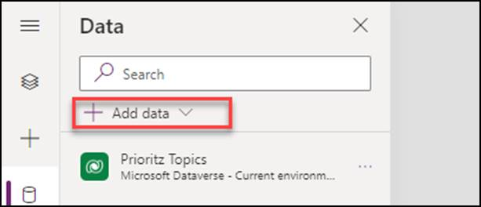
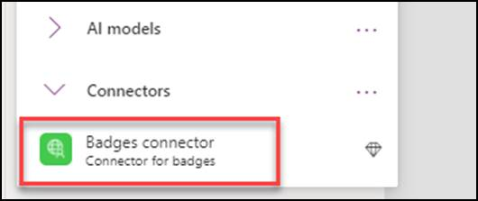
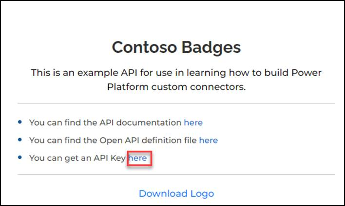
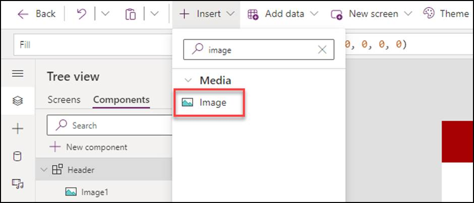
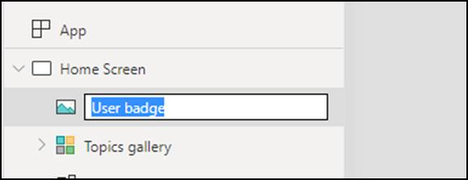
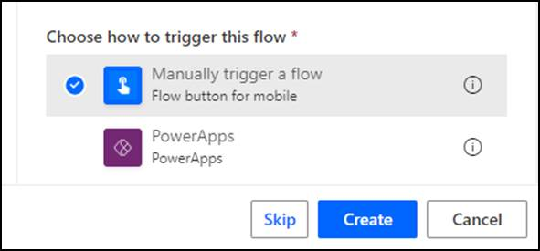
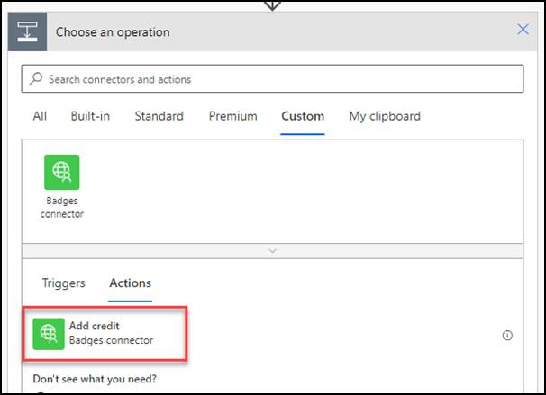
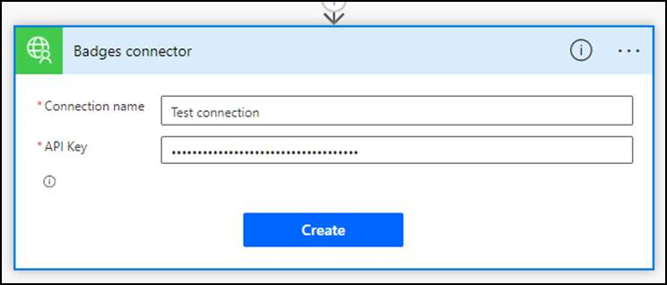
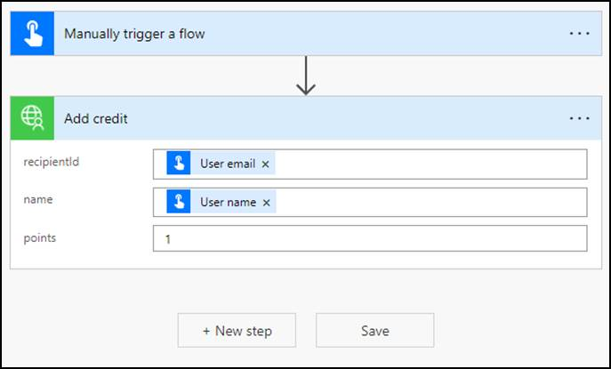

:::info LAB SCENARIO

Working as part of the PrioritZ fusion team you will be configuring a custom connector for an existing API.  The team would like to add badging to the PrioritZ application to give credit to users when they have completed ranking an item.  The team identified an existing API, but it doesn't have a Power Platform connector.  

When you review the API, you see that it has four operations and uses API key authentication.


In **Exercise 3** you will test the custom connector you created using a flow and a canvas application.
:::

## 3.1 Test connector from canvas app

:::tip Note
In this task, you will use the custom connector you created to show the user’s current badge on the PrioritZ Ask canvas application.
:::

1.	Navigate to [**Power Apps maker portal**](https://aka.ms/lowcode-february/makerportal) and make sure you are in your dev environment. 
2.	Expand **Solutions** and open the **PrioritZ** solution.
3.	Select **Apps**, select the **PrioritZ** Ask application, and click **Edit**.



4.	Select **Data** from the left and click **+ Add data**.



5.	Expand **Connectors** and select the **Badges connector** you created.



6.	Click **+ Add a connection**.
7.	Open a new browser tab or window and navigate to [**Contoso Coffee Badges**](https://aka.ms/lowcode-february/workshop/contoso) 

8.	Click on open the **API Key** link



9.	Copy the **API Key**. Keep this API Key in a notepad, you will need it again.
10.	Go back to the app designer, paste the **API Key** you copied, and click **Connect**.


11.	Select the **Tree view**.

12.	Select the **Components** tab, click **+ Insert** tab, search for image and select **Image**.



13.	Change the Image name to **User badge**.



14.	Set the User badge Image value to the formula below.
```
ContosoBadges.getcurrentbadge({id:User().Email}).image
```


15.	Set the Tooltip value of the User badge to the formula below.
```
ContosoBadges.getcurrentbadge({id:User().Email}).name
```

16.	Make the image smaller and move it to top right corner of the screen.
17.	The User badge should now look like the image below. 


18.	Select **Screens** tab in the Tree view. Click **Play** button.
19.	Hover over the badge to see the badge name.


20.	Close the preview. 

## 3.2 Publish the connector

1.  Click **Publish**.
2.	Select **Publish this version**.
3.	Go back to the solution by clicking on the **Back** button.


:::tip Note  
Do not navigate away from this page.
:::

## 3.3 Test connector from flow (optional)

1.	Make sure you are still in the **PrioritZ** solution.
2.	Click **+ New** and select **Automation | Cloud flow | Instant**.


3.	Enter **Test add credit** for flow name, select **Manually trigger a flow**, and click **Create**.



4.	Click **+ New step**.

5.	Select the **Custom** tab and then select the **Add credit** action.



6.	Enter **Test connection**, paste the **API Key** you copied earlier, and click **Create**.



7.	Click on the **recipientId** field, go to the Dynamic content pane, and select **User email**.


8.	Click on the **name** field, go to the Dynamic content pane, and select **User name**.

9.	Enter **1** for points and click **Save**. Wait for the flow to be saved.



10.	Hit **Test** to test the flow 👉 Select **Manually** and click **Test** again.

12.	Click **Continue** 👉 **Run flow** 👉 **Done**.

:::tip Note
The flow run should succeed.
:::

## 3.4 Run the flow (optional)

1.	Click on the back button.


2.	Select **Cloud flows** and open the flow you created.


18.	Start a new browser window and navigate to [**Power Apps maker portal**](https://aka.ms/lowcode-february/makerportal).

:::tip Note 
Make sure you are in the correct environment.
:::

20.	Select **Apps** and launch the **PrioritZ Ask** application.

:::info The application should now show **First Badge**.


:::

22.	Go back to flow and run it couple more times.
23.	Go back to the **PrioritZ Ask** application and refresh the page.

:::info You should now see the **Team Player** badge.


:::

25.	Go to the flow and run it two more times.
26.	Go back to the **PrioritZ Ask** application and refresh the page.


:::info You should now see the **Champ** badge.


:::